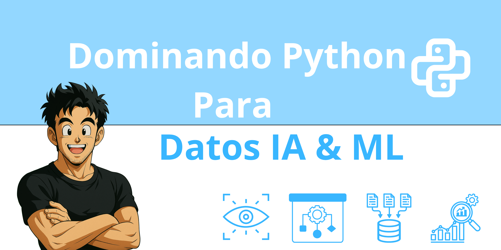

# Bienvenido al Curso Completo de Python para Ciencia de Datos, IA y ML en Español

¡Prepárate para un viaje completo en el mundo de Python aplicado a la Ciencia de Datos, Inteligencia Artificial y Machine Learning! Este curso está diseñado para llevarte desde CERO hasta ser capaz de construir y desplegar tus propias aplicaciones, creando un portafolio sólido en el proceso.

Nos enfocaremos en las **mejores prácticas** tanto del desarrollo de software como de la aplicación de Python en el análisis de datos y la IA, siguiendo la guía de estilo **PEP 8** para un código limpio y legible.

## Estructura del Curso

El curso se divide en los siguientes módulos, diseñados para un aprendizaje progresivo:

**Módulo 0: Introducción y Configuración del Entorno**
*   [x] Bienvenida y objetivos del curso. ([Modulo_00_Introduccion_Configuracion/00_Bienvenida_Objetivos.md](Modulo_00_Introduccion_Configuracion/00_Bienvenida_Objetivos.md))
*   [x] ¿Por qué Python para Ciencia de Datos, IA y ML? ([Modulo_00_Introduccion_Configuracion/01_Por_Que_Python.md](Modulo_00_Introduccion_Configuracion/01_Por_Que_Python.md))
*   [x] Instalación de Python y Anaconda/Miniconda. ([Modulo_00_Introduccion_Configuracion/02_Instalacion_Python_Anaconda.md](Modulo_00_Introduccion_Configuracion/02_Instalacion_Python_Anaconda.md))
*   [x] Uso de la terminal/línea de comandos. ([Modulo_00_Introduccion_Configuracion/03_Uso_Terminal.md](Modulo_00_Introduccion_Configuracion/03_Uso_Terminal.md))
*   [x] Introducción a los IDEs (VS Code, Jupyter Notebooks/Lab). ([Modulo_00_Introduccion_Configuracion/04_Introduccion_IDEs.md](Modulo_00_Introduccion_Configuracion/04_Introduccion_IDEs.md))
*   [x] Gestión de entornos virtuales (`conda`, `venv`). ([Modulo_00_Introduccion_Configuracion/05_Entornos_Virtuales.md](Modulo_00_Introduccion_Configuracion/05_Entornos_Virtuales.md))
*   [x] Introducción a Git y GitHub para control de versiones. ([Modulo_00_Introduccion_Configuracion/06_Introduccion_Git_GitHub.md](Modulo_00_Introduccion_Configuracion/06_Introduccion_Git_GitHub.md))

**Módulo 1: Fundamentos de Python (Nivelación)**
*   [x] Sintaxis básica, comentarios, sangría. ([Modulo_01_Fundamentos_Python/00_Sintaxis_Comentarios_Sangria.md](Modulo_01_Fundamentos_Python/00_Sintaxis_Comentarios_Sangria.md))
*   [x] Variables y tipos de datos primitivos (int, float, bool, str). ([Modulo_01_Fundamentos_Python/01_Variables_Tipos_Datos.md](Modulo_01_Fundamentos_Python/01_Variables_Tipos_Datos.md))
*   [x] Operadores (aritméticos, comparación, lógicos). ([Modulo_01_Fundamentos_Python/02_Operadores.md](Modulo_01_Fundamentos_Python/02_Operadores.md))
*   [x] Estructuras de datos: Listas, Tuplas, Diccionarios, Conjuntos (Sets). ([Modulo_01_Fundamentos_Python/03_Estructuras_Datos.md](Modulo_01_Fundamentos_Python/03_Estructuras_Datos.md))
*   [x] Control de flujo: Condicionales (`if`, `elif`, `else`). ([Modulo_01_Fundamentos_Python/04_Control_Flujo_Condicionales.md](Modulo_01_Fundamentos_Python/04_Control_Flujo_Condicionales.md))
*   [x] Bucles: `for` y `while`. `break`, `continue`. ([Modulo_01_Fundamentos_Python/05_Control_Flujo_Bucles.md](Modulo_01_Fundamentos_Python/05_Control_Flujo_Bucles.md))
*   [x] Funciones: Definición, parámetros, retorno, scope. ([Modulo_01_Fundamentos_Python/06_Funciones.md](Modulo_01_Fundamentos_Python/06_Funciones.md))
*   [x] Manejo de errores básicos (`try`, `except`). ([Modulo_01_Fundamentos_Python/07_Manejo_Errores.md](Modulo_01_Fundamentos_Python/07_Manejo_Errores.md))
*   [x] Buenas prácticas iniciales y PEP 8. ([Modulo_01_Fundamentos_Python/08_Buenas_Practicas_PEP8.md](Modulo_01_Fundamentos_Python/08_Buenas_Practicas_PEP8.md))

**Módulo 2: Python Intermedio y Estructura de Proyectos**
*   [x] Programación Orientada a Objetos (Clases, objetos). ([Modulo_02_Python_Intermedio_Estructura/00_POO_Clases_Objetos.md](Modulo_02_Python_Intermedio_Estructura/00_POO_Clases_Objetos.md))
*   [x] Programación Orientada a Objetos (Herencia). ([Modulo_02_Python_Intermedio_Estructura/01_POO_Herencia.md](Modulo_02_Python_Intermedio_Estructura/01_POO_Herencia.md))
*   [x] Programación Orientada a Objetos (Encapsulamiento). ([Modulo_02_Python_Intermedio_Estructura/02_POO_Encapsulamiento.md](Modulo_02_Python_Intermedio_Estructura/02_POO_Encapsulamiento.md))
*   [x] Módulos y Paquetes: Importación, creación. ([Modulo_02_Python_Intermedio_Estructura/03_Modulos_Paquetes.md](Modulo_02_Python_Intermedio_Estructura/03_Modulos_Paquetes.md))
*   [x] Manejo de Ficheros (lectura, escritura). ([Modulo_02_Python_Intermedio_Estructura/04_Manejo_Ficheros.md](Modulo_02_Python_Intermedio_Estructura/04_Manejo_Ficheros.md))
*   [x] Comprensión de listas, diccionarios y sets. ([Modulo_02_Python_Intermedio_Estructura/05_Comprensiones.md](Modulo_02_Python_Intermedio_Estructura/05_Comprensiones.md))
*   [x] Funciones Lambda, `map`, `filter`. ([Modulo_02_Python_Intermedio_Estructura/06_Lambdas_Map_Filter.md](Modulo_02_Python_Intermedio_Estructura/06_Lambdas_Map_Filter.md))
*   [x] Introducción a Decoradores. ([Modulo_02_Python_Intermedio_Estructura/07_Decoradores.md](Modulo_02_Python_Intermedio_Estructura/07_Decoradores.md))
*   [x] Estructura de un proyecto Python estándar. ([Modulo_02_Python_Intermedio_Estructura/08_Estructura_Proyecto.md](Modulo_02_Python_Intermedio_Estructura/08_Estructura_Proyecto.md))
*   [x] Introducción a las pruebas unitarias (`unittest` o `pytest`). ([Modulo_02_Python_Intermedio_Estructura/09_Pruebas_Unitarias.md](Modulo_02_Python_Intermedio_Estructura/09_Pruebas_Unitarias.md))

**Módulo 3: NumPy - Computación Numérica**
*   [x] Introducción a NumPy: Arrays (`ndarray`). ([Modulo_03_NumPy/00_Introduccion_NumPy_Arrays.md](Modulo_03_NumPy/00_Introduccion_NumPy_Arrays.md))
*   [x] Creación de arrays, indexación, slicing. ([Modulo_03_NumPy/01_Creacion_Arrays_Indexacion_Slicing.md](Modulo_03_NumPy/01_Creacion_Arrays_Indexacion_Slicing.md))
*   [x] Operaciones matemáticas y estadísticas vectorizadas. ([Modulo_03_NumPy/02_Operaciones_Vectorizadas.md](Modulo_03_NumPy/02_Operaciones_Vectorizadas.md))
*   [x] Broadcasting. ([Modulo_03_NumPy/03_Broadcasting.md](Modulo_03_NumPy/03_Broadcasting.md))
*   [x] Ejercicios prácticos con datos numéricos. ([Modulo_03_NumPy/04_Ejercicios_NumPy.md](Modulo_03_NumPy/04_Ejercicios_NumPy.md))

**Módulo 4: Pandas - Manipulación y Análisis de Datos**
*   [x] Introducción a Pandas: Series y DataFrames. ([Modulo_04_Pandas/00_Introduccion_Pandas_Series_DataFrames.md](Modulo_04_Pandas/00_Introduccion_Pandas_Series_DataFrames.md))
*   [x] Lectura y escritura de datos (CSV, Excel, etc.). ([Modulo_04_Pandas/01_Lectura_Escritura_Datos.md](Modulo_04_Pandas/01_Lectura_Escritura_Datos.md))
*   [x] Selección, filtrado, indexación (loc, iloc). ([Modulo_04_Pandas/02_Seleccion_Filtrado_Indexacion.md](Modulo_04_Pandas/02_Seleccion_Filtrado_Indexacion.md))
*   [x] Limpieza de datos: Nulos, duplicados. ([Modulo_04_Pandas/03_Limpieza_Datos_Nulos_Duplicados.md](Modulo_04_Pandas/03_Limpieza_Datos_Nulos_Duplicados.md))
*   [x] Agrupación de datos (`groupby`). ([Modulo_04_Pandas/04_Agrupacion_Datos_Groupby.md](Modulo_04_Pandas/04_Agrupacion_Datos_Groupby.md))
*   [x] Combinación de DataFrames (`merge`, `join`, `concat`). ([Modulo_04_Pandas/05_Combinacion_DataFrames.md](Modulo_04_Pandas/05_Combinacion_DataFrames.md))
*   [x] Series temporales (básico). ([Modulo_04_Pandas/06_Series_Temporales.md](Modulo_04_Pandas/06_Series_Temporales.md))
*   [x] Ejercicios de análisis exploratorio de datos (EDA). ([Modulo_04_Pandas/07_Ejercicios_Pandas_EDA.md](Modulo_04_Pandas/07_Ejercicios_Pandas_EDA.md))

**Módulo 5: Visualización de Datos**
*   [x] Introducción a Matplotlib: Gráficos básicos. ([Modulo_05_Visualizacion_Datos/00_Introduccion_Matplotlib_Basico.md](Modulo_05_Visualizacion_Datos/00_Introduccion_Matplotlib_Basico.md))
*   [x] Personalización de gráficos con Matplotlib. ([Modulo_05_Visualizacion_Datos/01_Personalizacion_Matplotlib.md](Modulo_05_Visualizacion_Datos/01_Personalizacion_Matplotlib.md))
*   [x] Introducción a Seaborn: Gráficos estadísticos. ([Modulo_05_Visualizacion_Datos/02_Introduccion_Seaborn.md](Modulo_05_Visualizacion_Datos/02_Introduccion_Seaborn.md))
*   [x] Visualización de relaciones, distribuciones, categorías con Seaborn. ([Modulo_05_Visualizacion_Datos/03_Seaborn_Relaciones_Distribuciones_Categorias.md](Modulo_05_Visualizacion_Datos/03_Seaborn_Relaciones_Distribuciones_Categorias.md))
*   [x] (Opcional) Gráficos interactivos (Plotly/Streamlit). ([Modulo_05_Visualizacion_Datos/04_Graficos_Interactivos_Plotly_Streamlit.md](Modulo_05_Visualizacion_Datos/04_Graficos_Interactivos_Plotly_Streamlit.md))

**Módulo 6: Fundamentos de Machine Learning con Scikit-learn**
*   [x] Conceptos clave: Supervisado vs. No supervisado, entrenamiento, prueba. ([Modulo_06_Machine_Learning_ScikitLearn/00_Conceptos_Clave_ML.md](Modulo_06_Machine_Learning_ScikitLearn/00_Conceptos_Clave_ML.md))
*   [x] Preprocesamiento de datos: Escalado, codificación. ([Modulo_06_Machine_Learning_ScikitLearn/01_Preprocesamiento_Escalado_Codificacion.md](Modulo_06_Machine_Learning_ScikitLearn/01_Preprocesamiento_Escalado_Codificacion.md))
*   [x] División de datos (train/test split). ([Modulo_06_Machine_Learning_ScikitLearn/02_Division_Datos_Train_Test.md](Modulo_06_Machine_Learning_ScikitLearn/02_Division_Datos_Train_Test.md))
*   [x] Modelos de Regresión (Lineal, etc.). ([Modulo_06_Machine_Learning_ScikitLearn/03_Modelos_Regresion.md](Modulo_06_Machine_Learning_ScikitLearn/03_Modelos_Regresion.md))
*   [x] Modelos de Clasificación (Logística, K-NN, SVM, Árboles). ([Modulo_06_Machine_Learning_ScikitLearn/04_Modelos_Clasificacion.md](Modulo_06_Machine_Learning_ScikitLearn/04_Modelos_Clasificacion.md))
*   [x] Evaluación de modelos: Métricas comunes. ([Modulo_06_Machine_Learning_ScikitLearn/05_Evaluacion_Modelos.md](Modulo_06_Machine_Learning_ScikitLearn/05_Evaluacion_Modelos.md))
*   [x] Selección de características y reducción de dimensionalidad (PCA básico). ([Modulo_06_Machine_Learning_ScikitLearn/06_Seleccion_Caracteristicas_PCA.md](Modulo_06_Machine_Learning_ScikitLearn/06_Seleccion_Caracteristicas_PCA.md))
*   [x] Flujo de trabajo de un proyecto de ML. ([Modulo_06_Machine_Learning_ScikitLearn/07_Flujo_Trabajo_ML.md](Modulo_06_Machine_Learning_ScikitLearn/07_Flujo_Trabajo_ML.md))

**Módulo 7: Introducción a la Inteligencia Artificial y Deep Learning**
*   [x] Diferencias entre IA, ML y DL. ([Modulo_07_Intro_IA_DeepLearning/00_Diferencias_IA_ML_DL.md](Modulo_07_Intro_IA_DeepLearning/00_Diferencias_IA_ML_DL.md))
*   [x] Introducción a las redes neuronales. ([Modulo_07_Intro_IA_DeepLearning/01_Intro_Redes_Neuronales.md](Modulo_07_Intro_IA_DeepLearning/01_Intro_Redes_Neuronales.md))
*   [x] Frameworks populares: TensorFlow y/o PyTorch (conceptos básicos). ([Modulo_07_Intro_IA_DeepLearning/02_Frameworks_TensorFlow_PyTorch.md](Modulo_07_Intro_IA_DeepLearning/02_Frameworks_TensorFlow_PyTorch.md))
*   [x] Visión general de áreas: NLP, Visión por Computador, Sistemas de Recomendación. ([Modulo_07_Intro_IA_DeepLearning/03_Vision_General_Areas_IA.md](Modulo_07_Intro_IA_DeepLearning/03_Vision_General_Areas_IA.md))
*   [x] Creación de un modelo simple (ej. clasificación MNIST). ([Modulo_07_Intro_IA_DeepLearning/04_Creacion_Modelo_Simple_MNIST.md](Modulo_07_Intro_IA_DeepLearning/04_Creacion_Modelo_Simple_MNIST.md))
*   [x] Ética en la IA. ([Modulo_07_Intro_IA_DeepLearning/05_Etica_IA.md](Modulo_07_Intro_IA_DeepLearning/05_Etica_IA.md))

**Módulo 8: Python Avanzado**
*   [ ] Generadores y Expresiones Generadoras.
*   [ ] Decoradores (uso avanzado).
*   [ ] Context Managers (`with` statement).
*   [ ] Manejo Avanzado de Excepciones.
*   [ ] Programación Funcional Avanzada (`functools`, `itertools`).
*   [ ] Tipado Estático (Type Hinting).
*   [ ] (Opcional) Introducción a Concurrencia/Paralelismo.

**Módulo 9: Proyectos de Portafolio y Despliegue**
*   [ ] Desarrollo guiado de 2-3 proyectos completos.
*   [ ] Creación de APIs simples con Flask/FastAPI.
*   [ ] **Despliegue con Docker:** Contenerización de aplicaciones/modelos.
*   [ ] Visión general de otras opciones de despliegue (Streamlit Cloud, Heroku, etc.).
*   [ ] Consejos para construir y presentar el portafolio.

## ¡Empecemos!

Este `README.md` servirá como nuestra guía principal. Iremos marcando los temas a medida que los cubramos. ¡Estamos listos para comenzar a construir este increíble curso!
